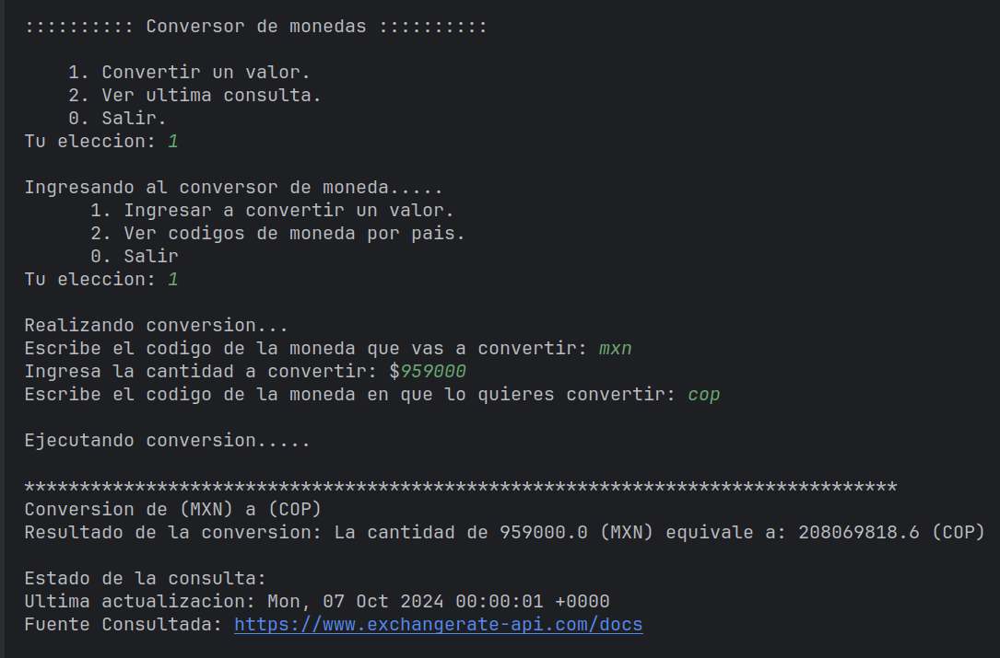
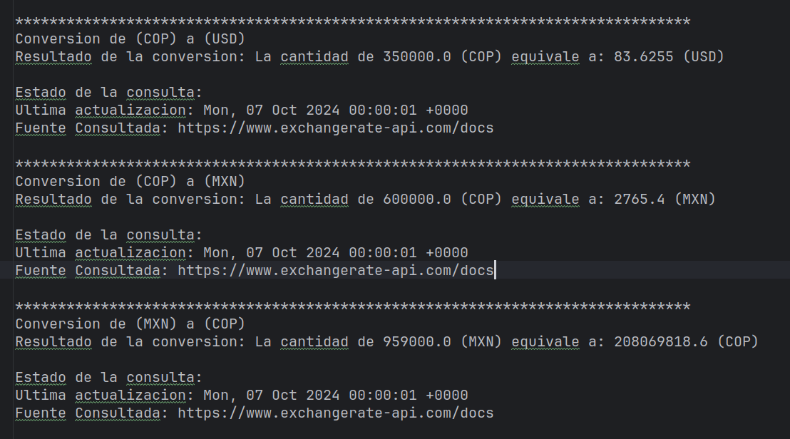
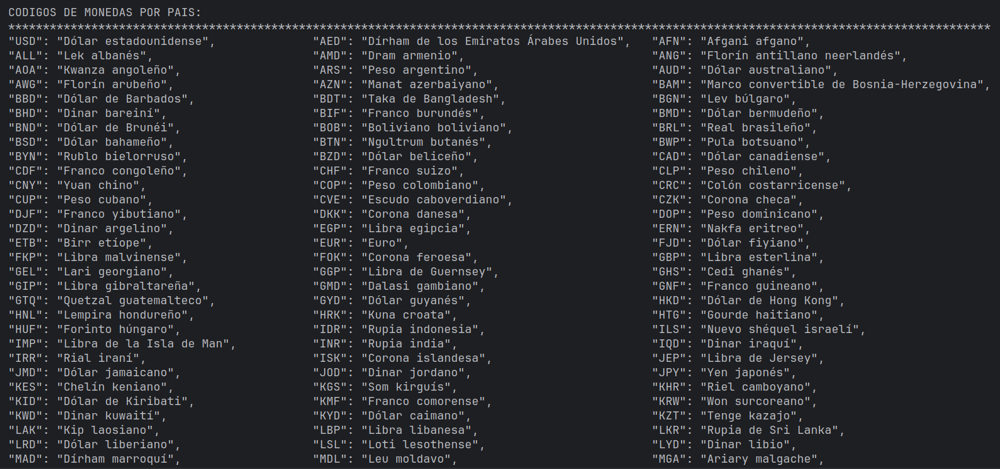
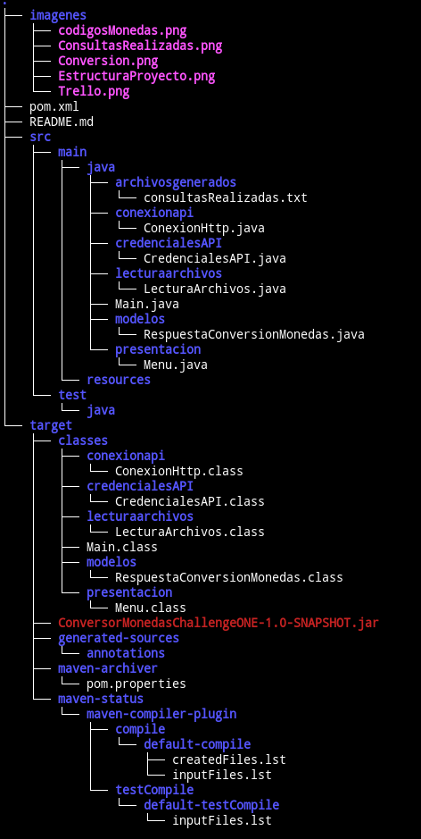
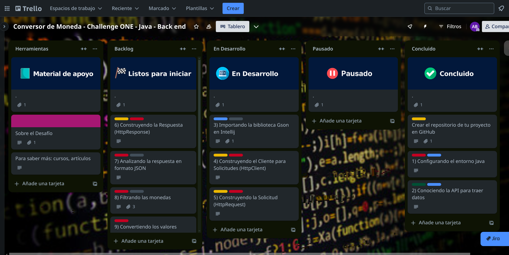

# Conversor de monedas 🤑
## 🧑‍🎓 Primer Challenge de la especialización en Backend del programa ONE

- Conversor de monedas en ejecucion:

- Archivo .txt que almacena las consultas realizadas:
  

## Descripcion:
Este es un conversor de monedas desarrollado en Java que utiliza la API de 
ExchangeRate (https://www.exchangerate-api.com/).

El sistema permite la conversión de monedas mediante pares: primero, el 
usuario ingresa el código de la moneda de origen y luego el código de la 
moneda a la que desea convertir el valor introducido. A continuación, se 
realiza una solicitud a la API, se convierte el valor dentro de la aplicación 
y se obtiene así el valor convertido a la moneda deseada.

La aplicación ofrece la posibilidad de convertir un valor, consultar los 
códigos de las monedas disponibles y revisar las consultas realizadas, las 
cuales se almacenan en un archivo con extensión .txt en el directorio de 
archivos generados.

- Codigos de monedas para realizar una conversion:
  

### 📝 Objetivos: 

#### 1. Poner en practica los conocimientos adquiridos en los cursos de backend con JAVA del programa ONE.
#### 2. Crear un proyecto real para simular los desafios que enfrenta en el dia a dia un desarrollador en su trabajo.
#### 3. Agregar un proyecto a nuestro portafolio que demuestre nuestras habilidades.
#### 4. Desarrollar una aplicación en Java que consuma una API, transforme los datos obtenidos y los muestre al usuario final.
#### 5. Trabajar con el formato JSON y utilizar librerias de JAVA que nos permitan transformar estos datos.
#### 6. Comprender el Protocolo HTTP y sus Métodos (GET - POST - PUT - DELETE)
#### 7. Escribir archivos utilizando librerias de Java.
 

- Estructura del proyecto:

##  🧑‍💻 Tecnologias y herramientas utilizadas:

#### 1. Lenguaje de programación JAVA.
#### 2. MAVEN como gestor de dependencias.
#### 3. Librerias externas ( OkHttpClient - Gson ).
#### 4. POSTMAN para realizar pruebas.
#### 5. GIT y GITHUB para llevar un control de versiones.
#### 6. TRELLO para la gestion de tareas.
#### 7. Consumo de Exchange Rate API. 📈
 

- Gestion de tareas con Trello:

